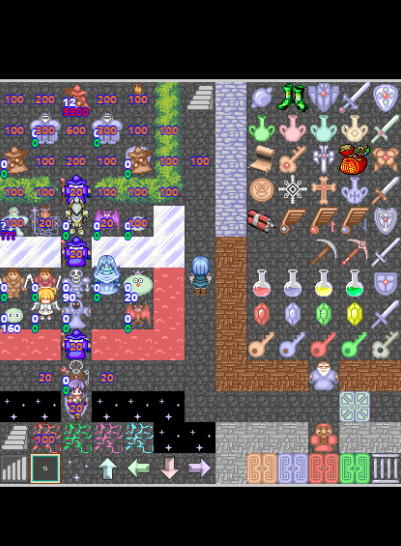
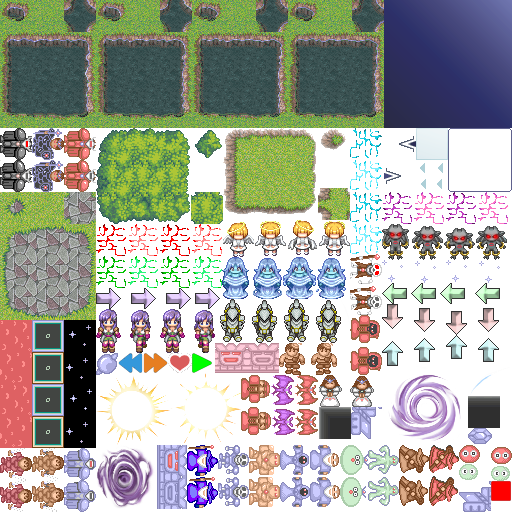

# [mota-js](https://github.com/ckcz123/mota-js)
使用[`pixijs`](https://github.com/pixijs/pixi.js) 和 [`tween.js`](https://github.com/tweenjs/tween.js) 和 es6 

## 目录详情：
+ mota-js ：主程序 [mota-js](https://github.com/ckcz123/mota-js)
+ pixi ：pixi.js的引入和部分使用
+ nodeControl ： 用node.js做的一些格式化处理，和预先处理
+ test ： 一些测试工作  
## 当前进度：
（画面显示正在进行中...已完成bg、event、hero、fg、damage）  
 

## 已完成，待优化：
√：尝试node和[`free-tex-packer-core`](https://github.com/odrick/free-tex-packer-core)  和 [`jimp`](https://github.com/oliver-moran/jimp)。  
遍历地图，将使用的图块(包括icons，animates)集中到一张图片上，或者将附加的较小的图片也综合成一张图（最大尺寸512*512，大于的话分成多个图片）（较大的图片独立出来，不打包），得到png和json 来进行加载；  
  => nodeControl中的main.js  
  => webpack编译(`npm run buildNode`)后变成 `./nodeControl/index.bundle.js`  
  => 使用node执行`index.bundle.js`后得到`./nodeControl/data/{packer.json, packer.png}`  
;

√：使用pixi.js导入json，以及加载的过程（加载的过程有一个动画scene 待后续scene完善后再添加）  
√：绘制背景~
## 目前在做： 
* 首先尝试所有的显示功能，再进行操作，再大改
* 动画图片导入后切割成动画（由于打包时对图片进行了剪切，而生成texture不继承切割，需要自己弄一套）
* 在runtime里加载打包出的json和png，来加载图片，并使得图片和tween能够对应起来
* 再优化一下scene类，进而实现各种效果
* 导入之前做好的nodes类（待优化）
* resize时获取三种类的位置statusBar game toolBar 类

## TODO：
> + import 导入 √ （资源还没能导入）
> + 加载image后生成baseTexture
> + 加载block时加载对应sprite缓存，加载node（节点）
> + 设置scene（statusBar、toolBar、game)  
> scene顶层触发按键向下层分发，分发到game停止，触发  
control.js的操作逻辑
> 点击在game有个点击层，也是触发，并组织children有interactive
> + 全部sprite化，只有一个canvas
> + 在build时将所有用到的图片压缩到一张，加载时也只加载这一张图，并生成对应的json文件 